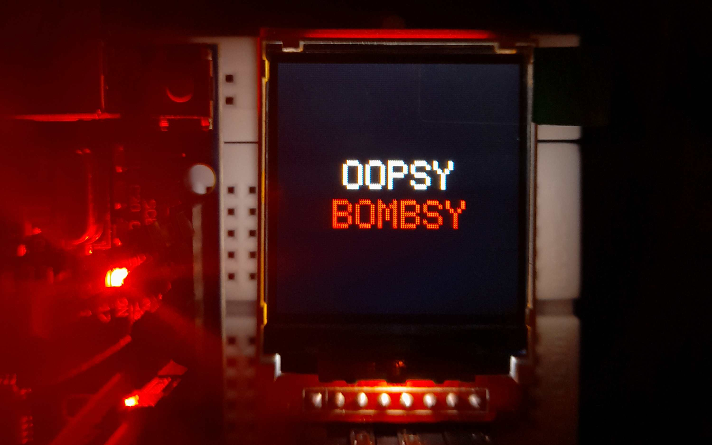
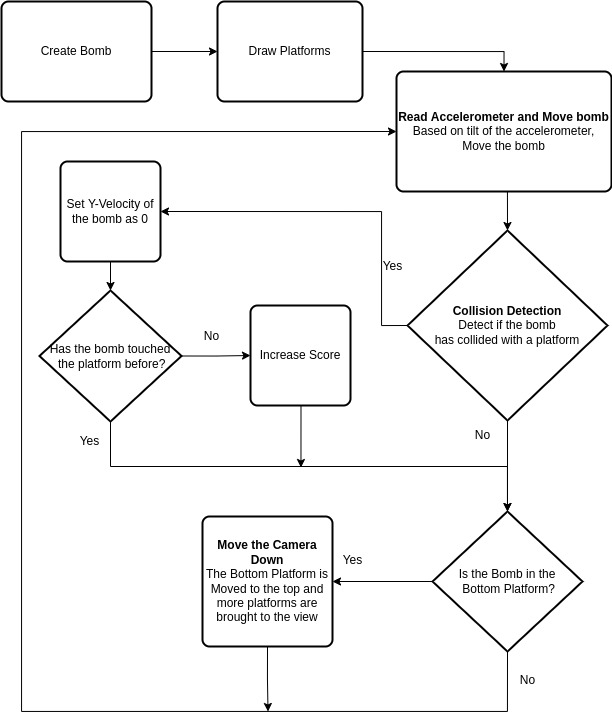
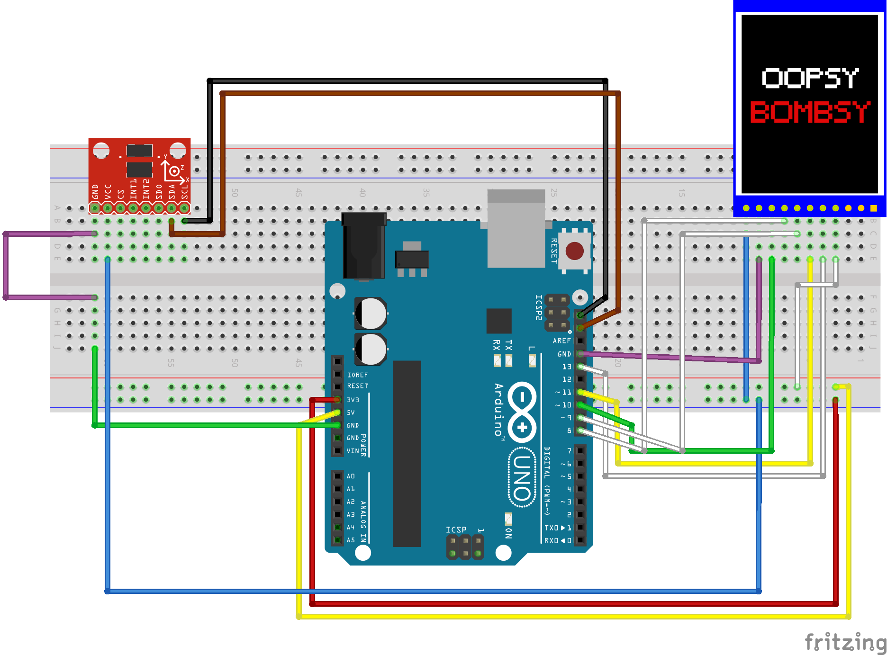

*Dr. Round is an astronaut on the ISS in the year 2203. While on a space walk, Dr. Round accidentally dropped a bomb that he held and now the bomb is on its way hurling to hit Earth.* 

*An object when dropped in space can hit the earth with so much force that it releases enough energy to annihilate the earth.* 

*Luckily the international space agency had preventive measures just in case such a situation arises. It had a series of rocket powered platforms that help to slow down the speed of the ball before it annihilates the earth. But due to poor maintainance a few of these platforms can trigger the bomb to explode.* 

#### *Can you save the earth by aiding the bomb to fall gracefully?*

## Required Devices

1. Arduino UNO
2. ADXL345 Accelerometer
3. 1.44" TFT Display
   
## Connections 

Follow these links to connect the arduino to the the sensors - 

1. [Connect Arduino with Accelerometer](https://pimylifeup.com/arduino-accelerometer-adxl345/)
2. [Connect Arduino with TFT Display](https://www.instructables.com/Using-TFT-144-With-Arduino-Nano/)

## Playing the game

Upload new_game/new_game.ino to the arduino to play the game on the tft screen.

## Overview of how the Game Functions



This is a platform game where the end goal of the user is to get the bomb as close to the earth as possible. We start by first setting the stage by drawing the bomb and the platforms after which the game's event loop is initiated. In each loop we read the accelerometer values and based on the tilt of the accelerometer we move the bomb. While the bomb is in motion we check if the bomb has collided with any of the platforms. If it hasnt we let the ball fall. If it has, we then check if it has been resting on the platform or it has just landed on the platform. If the case is the latter we increase the score, else we continue the game. If we notice that the bomb has hit the bottom platform, then we move the camera downwards by raising the bottom most platform to the first platform and introducing new platforms.

## Circuit Diagram



## Game Features

#### Ball
Hero/player of the game. The object has to cross various platforms inorder score points.
#### Platform
1. **Green Platform:** This is the basic platform on which the ball will land.
2. **Yellow Platform:** This is a platform with a to and fro motion.
3. **Red Platform:** This is a pass through platform.
#### Spikes
The spikes are the obstacle which should be avoided by the ball.
#### Complexity
The game complexity would increase with the **increase in the game score**. The complexity would with indroduced in the following ways:
1. Increase in the ball sensitivity
2. Reducing the plaform size
3. Increase the platform speed
4. Introducing the various platforms at random
5. Introducing spikes on the platform
#### Scoring system

Score of the game would increase by 1 unit as soon as the ball hits a particular platform.

#### End of the Game

The game would end when the ball falls out of the screen.

## Code Manual

The code in this repository is divided into the following structure

### Directory Structure

```.
├── BlockDiagram.jpg
├── circuit_bb.png
├── circuit.fzz
├── main
│   └── main.ino
├── README.md
└── test
    ├── adxl345_test
    │   ├── accel.h
    │   └── adxl345_test.ino
    ├── anim_test
    │   └── anim_test.ino
    └── bounce
        └── bounce.ino
```

### Instructions to run the code

- The main code is in the main folder.
- Open the main.ino file in the arduino IDE.
- Connect the arduino to the computer.
- Upload the code to the arduino.
- Open the serial monitor and set the baud rate to 9600. (OPTIONAL)
- The game should start on the tft display.

### Files

#### test

- This folder contains the test code for the accelerometer and the tft display.
- The accelerometer test code is in the adxl345_test folder.
- The tft display test code is in the anim_test folder.
- The bounce test code is in the bounce folder.

#### main

- This folder contains the main code for the game.
- It has all the libraries and headers bundled in the main.ino file.

### Libraries Used

#### Third Party Libraries

- **Adafruit GFX**: This library is used to draw shapes on the tft display.
- **Adafruit ST7735 and ST7789 Library**: This library is used to control the tft display.
- **Adafruit BusIO**: This library is used to communicate with the accelerometer.
- **Adafruit ADXL345**: This library is used to control the accelerometer.

#### General Libraries

- **SPI**: This library is used to communicate with the tft display.
- **Wire**: This library is used to communicate with the accelerometer.
